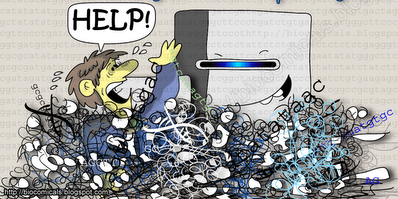

```{r setup, include=FALSE}
knitr::opts_chunk$set(
  echo = FALSE, warning = FALSE, message = FALSE,
  fig.width = 7, fig.height = 6, fig.align='center',
  dpi = 300
)
hook_source <- knitr::knit_hooks$get('source')
knitr::knit_hooks$set(source = function(x, options) {
  x <- stringr::str_replace(x, "^[[:blank:]]?([^*].+?)[[:blank:]]*#<<[[:blank:]]*$", "*\\1")
  hook_source(x, options)
})
options(htmltools.dir.version = TRUE)
```

```{r extra}
xaringanExtra::use_panelset()
xaringanExtra::use_scribble()
xaringanExtra::use_tile_view()
```

## The problem

<br />

.center[GWAS can identify SNPs associated with traits, but not the underlying genes.

Hundreds of putative candidate genes. What then?
]

```{r out.width='65%'}

```

---

## *cageminer* to the rescue!

```{r out.width='95%'}
knitr::include_graphics("figs/Fig1.png")
```

---

## Required input data

.panelset.sideways[
.panel[.panel-name[SNP positions]

A GRanges or GRangesList object.

```{r echo=TRUE}
set.seed(123)
library(cageminer)
data(snp_pos)
snp_pos
```
]
.panel[.panel-name[Gene coordinates]

A GRanges object.

```{r echo=TRUE}
data(gene_ranges)
head(gene_ranges)
```
]
.panel[.panel-name[Guide genes]

Character vector or a 2-column data frame with genes in column 1 and gene functional class (e.g., pathway, GO) in column 2.

```{r echo=TRUE}
data(guides)
head(guides)
```
]
.panel[.panel-name[Expression data]

SummarizedExperiment object or matrix/data frame with genes in rows and samples in columns.

```{r echo=TRUE}
data(pepper_se)
pepper_se
```
]

.panel[.panel-name[Coexpression network]

List object returned by `BioNERO::exp2gcn()`.

```{r}
data(gcn)
```

```{r echo=TRUE, eval=FALSE}
# Infer network
gcn <- BioNERO::exp2gcn(pepper_se, SFTpower = 12)
```
]
]

---

## Exploratory analysis

<br />
`r emo::ji("thinking_face")` &nbsp; Are SNPs evenly distributed across chromosomes?

.pull-left[
```{r eda1, echo=TRUE, eval=FALSE}
plot_snp_distribution(snp_pos)
```
]
.pull-right[
```{r ref.label='eda1'}
```
]

---

## Exploratory analysis

<br />
`r emo::ji("thinking_face")` &nbsp; Are SNPs evenly distributed across chromosomes?
 (Handling multiple traits)

.pull-left[
```{r eda1_2, echo=TRUE, eval=FALSE}
# Simulate multiple traits by resampling
snp_list <- GenomicRanges::GRangesList(
  Trait1 = sample(snp_pos, 20),
  Trait2 = sample(snp_pos, 20),
  Trait3 = sample(snp_pos, 20),
  Trait4 = sample(snp_pos, 20)
)

# Visualize SNP distribution
plot_snp_distribution(snp_list)
```
]
.pull-right[
```{r ref.label='eda1_2'}
```
]

---

## Exploratory analysis

<br />
`r emo::ji("thinking_face")` &nbsp; Are SNPs physically close to each other?

.pull-left[
```{r eda2, echo=TRUE, eval=FALSE}
data(chr_length)
plot_snp_circos(chr_length, gene_ranges, 
                snp_pos)
```
]
.pull-right[
```{r ref.label='eda2'}
```
]

---

## Exploratory analysis

<br />
`r emo::ji("thinking_face")` &nbsp; Are SNPs physically close to each other? (handling multiple traits)

.pull-left[
```{r eda2_2, echo=TRUE, eval=FALSE}
data(chr_length)
plot_snp_circos(chr_length, gene_ranges, 
                snp_list) #<<
```
]
.pull-right[
```{r ref.label='eda2_2'}
```
]

---

## Gene mining

.panelset.sideways[

.panel[.panel-name[Step 1]
```{r echo=TRUE}
candidates1 <- mine_step1(gene_ranges, snp_pos)
length(candidates1)
```
]
.panel[.panel-name[Step 2]
```{r echo=TRUE}
candidates2 <- mine_step2(pepper_se, gcn = gcn, guides = guides$Gene,
                          candidates = candidates1$ID)
str(candidates2)
```
]
.panel[.panel-name[Step 3]
```{r echo=TRUE, out.width='30%'}
candidates3 <- mine_step3(pepper_se, candidates = candidates2$candidates,
                          sample_group = "PRR_stress")
candidates3
```
]
.panel[.panel-name[Wrapping up]

`mine_candidates()` is a wrapper that calls all 3 `mine_step*()` functions sequentially.

```{r echo=TRUE, eval=FALSE}
candidates <- mine_candidates(gene_ranges = gene_ranges, 
                              marker_ranges = snp_pos, 
                              exp = pepper_se,
                              gcn = gcn, guides = guides$Gene,
                              sample_group = "PRR_stress")
```
]
]

---

## Scoring and ranking candidates

<br />
Useful to pick the top *n* genes for validation, for instance.

.font140[
$$S_i = r_{pb} \kappa$$
] 

.center[
where:

$\kappa$ = 2 if the gene encodes a transcription factor

$\kappa$ = 2 if the gene is a hub

$\kappa$ = 3 is the gene is a hub + encodes a transcription factor

]

---

## Scoring and ranking candidates

```{r echo=TRUE}
data(tfs)
data(hubs)

# Score and rank candidates
scored <- score_genes(candidates3, hubs$Gene, tfs$Gene_ID)
scored
```

---

## Summary

From 1265 genes, `cageminer` found 5 high-confidence candidates (>99% reduction).

```{r, out.width='50%'}
library(ggplot2)
df <- data.frame(N = c(1265, 37, 5),
                 Step = c("S1", "S2", "S3"))
ggplot(df, aes(x=Step, y=N, group=1)) +
  geom_line(color="brown2") +
  geom_point(color="brown3") +
  theme_bw() +
  labs(y = "Number of candidates", x="",
       title = "Number of candidate genes after each step")
```

---

class: sydney-yellow, middle, center

## Here's where you can find me:

`r icons::fontawesome("twitter")`  [@almeidasilvaf](https://twitter.com/almeidasilvaf)

`r icons::fontawesome("github")`  [almeidasilvaf](https://github.com/almeidasilvaf/)

`r icons::fontawesome("globe")`  [almeidasilvaf.github.io/home](https://almeidasilvaf.github.io/home/)

`r icons::fontawesome("envelope")`  [fabricio_almeidasilva@hotmail.com](mailto:fabricio_almeidasilva@hotmail.com)

`r icons::academicons("orcid")`  [Fabricio Almeida-Silva](https://orcid.org/0000-0002-5314-2964)


